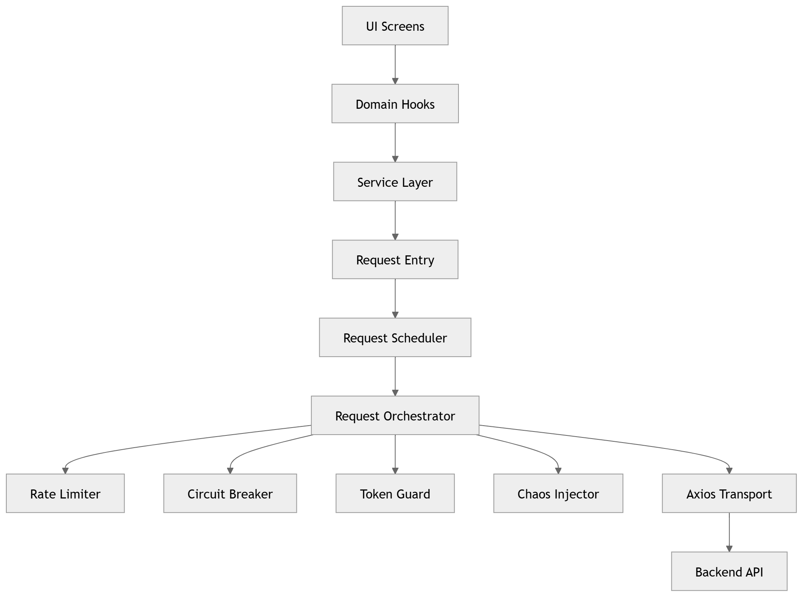

# React Native Network Control Plane


Enterprise-grade networking control plane for React Native applications.

This repository demonstrates how to build a **resilient, observable, and scalable networking control layer** designed to handle real-world mobile constraints such as:

* unstable networks
* concurrent API requests
* authentication expiration
* backend instability
* offline operation
* performance monitoring

Instead of letting UI components call APIs directly, this architecture introduces a **central networking control plane** responsible for governing every request.

## Table of Contents

- Architecture Overview
- Key Capabilities
- Architecture Layers
- Resilience Systems
- Offline Durability
- Real-Time Event System
- Observability
- Performance Governance
- Chaos Engineering
- Transport Layer
- Repository Structure
- Example Request Flow
- Installation
<!-- - Documentation -->
- Related Blog Series

---

# Architecture Overview



This design ensures API communication remains:

* **predictable**
* **resilient**
* **observable**
* **performance governed**

---

# Key Capabilities

| Capability                    | Implemented |
| ----------------------------- | ----------- |
| Layered architecture          | Yes         |
| Central request orchestration | Yes         |
| Client rate limiting          | Yes         |
| Circuit breaker protection    | Yes         |
| Token refresh protection      | Yes         |
| Offline mutation queue        | Yes         |
| Sequential replay engine      | Yes         |
| Structured logging            | Yes         |
| Metrics collection            | Yes         |
| Distributed tracing           | Yes         |
| Performance monitoring        | Yes         |
| Chaos engineering             | Yes         |
| Request prioritization        | Yes         |

---

# Architecture Layers

## 1. UI Layer

UI screens consume data through **domain hooks**.

Example:

`UsersScreen.tsx`

Responsibilities:

* render data
* show loading states
* display errors

UI components **never call networking code directly**.

---

## 2. Domain Hooks

Hooks act as the interface between UI and networking.

Example:

`useUsers.ts`

Hooks manage:

* data fetching
* caching
* retry behavior
* background refresh

Powered by **React Query**:

* request deduplication
* automatic caching
* stale data management

Example:

```ts
const { data, isLoading } = useUsers();
```

---

## 3. Service Layer

Services define **domain API endpoints**.

Example:

`userService.ts`

Responsibilities:

* define endpoints
* hide HTTP implementation
* provide reusable domain operations

Example service methods:

```
getUsers()
getUserById()
createUser()
updateUser()
deleteUser()
```

---

## 4. Request Layer

All API requests pass through a **central entry point**.

File:

```
src/core/network/request.ts
```

Responsibilities:

* enforce request governance
* integrate scheduling
* prevent direct HTTP calls

---

## 5. Request Scheduler

File:

```
src/core/network/scheduler.ts
```

Prioritizes requests before execution.

| Priority | Example         |
| -------- | --------------- |
| HIGH     | login, payments |
| NORMAL   | feed loading    |
| LOW      | analytics       |

This prevents **background tasks from blocking user actions**.

---

## 6. Request Orchestrator

File:

```
src/core/network/orchestrator.ts
```

The orchestrator is the **control tower of networking**.

Every request flows through the pipeline below.

```
Create Trace
↓
Rate Limiter
↓
Circuit Breaker Check
↓
Token Guard
↓
Chaos Injection
↓
HTTP Request
↓
Performance Budget Check
↓
Metrics + Logging
↓
Error Normalization
```

---

# Resilience Systems

## Rate Limiter

File:

```
src/core/network/rateLimiter.ts
```

Prevents API bursts caused by:

* rapid UI events
* multiple screens loading
* background refresh triggers

---

## Circuit Breaker

File:

```
src/core/network/circuitBreaker.ts
```

Stops requests when backend instability is detected.

Example:

```
API failures increase
↓
failure threshold reached
↓
circuit opens
↓
requests temporarily blocked
```

This prevents **cascading failures**.

---

## Token Refresh Guard

File:

```
src/core/auth/tokenGuard.ts
```

Prevents **token refresh storms**.

Without guard:

```
10 requests
↓
token expired
↓
10 refresh requests
```

With guard:

```
10 requests
↓
1 refresh request
↓
all others wait
```

---

# Offline Durability

Mobile apps must continue working **without connectivity**.

---

## Mutation Queue

File:

```
src/core/offline/mutationQueue.ts
```

Stores write operations in **persistent storage**.

Ensures mutations survive:

* app restarts
* OS process kills
* network loss

---

## Replay Engine

File:

```
src/core/offline/replayEngine.ts
```

Replays queued mutations when connectivity returns.

Mutations are replayed **sequentially** to avoid:

* duplicate writes
* inconsistent server state

---

# Real-Time Event System

File:

```
src/core/realtime/eventBus.ts
```

Decouples real-time events from UI.

Instead of:

```
socket → screen
```

The architecture uses:

```
socket → eventBus → domain events → UI
```

This ensures **modularity and scalability**.

---

# Observability

Production systems require strong **observability**.

---

## Structured Logging

File:

```
src/core/observability/logger.ts
```

Logs structured events.

Example log:

```json
[NETWORK] {
  "traceId": "8c2f1",
  "endpoint": "/users",
  "duration": 421,
  "message": "API success"
}
```

Logs can be sent to monitoring tools.

---

## Metrics

File:

```
src/core/observability/metrics.ts
```

Tracks:

* API success rate
* API failure rate
* request counts

---

## Distributed Tracing

File:

```
src/core/observability/trace.ts
```

Each request receives a **unique trace ID**.

This allows debugging **across services**.

---

# Performance Governance

File:

```
src/core/observability/performanceBudget.ts
```

Enforces API latency budgets.

Example:

```
API response > 2000ms
↓
performance warning logged
```

Helps identify **slow endpoints**.

---

# Chaos Engineering

File:

```
src/core/chaos/chaosInjector.ts
```

Randomly injects failures during development.

Purpose:

* validate retry systems
* test circuit breakers
* test error handling

Inspired by **chaos engineering used in distributed systems**.

---

# Transport Layer

File:

```
src/core/transport/axiosClient.ts
```

Lowest networking layer.

Responsibilities:

* configure HTTP client
* configure base URL
* configure timeouts
* set default headers

Transport layer **must not contain business logic**.

---

# Repository Structure

```
src
│
├── core
│   ├── auth
│   ├── chaos
│   ├── network
│   ├── observability
│   ├── offline
│   ├── realtime
│   └── transport
│
├── features
│   └── users
│       ├── api
│       ├── hooks
│       └── screens
│
└── App.tsx
```

---

# Example Request Flow

```
UsersScreen
↓
useUsers
↓
userService
↓
request()
↓
scheduler
↓
orchestrator
↓
rateLimiter
↓
circuitBreaker
↓
tokenGuard
↓
axiosClient
↓
API
```

---

# Prerequisites

Before running this project, ensure you have:

* Node.js >= 18
* React Native CLI
* Android Studio
* Xcode (for iOS)

---

# Installation

Clone the repository:

```
git clone https://github.com/adarsh-bharadwaj/react-native-network-control-panel.git
```

Install dependencies:

```
npm install
```

---

# Running the App

Android:

```
npx react-native run-android
```

iOS:

```
npx react-native run-ios
```

---

# Environment Configuration

Example `.env`

```
API_BASE_URL=https://api.example.com
REQUEST_TIMEOUT=10000
```

---

# Example API Usage

Example using domain hook:

```ts
const { data, isLoading, error } = useUsers();
```

---

<!-- # Documentation

Additional architecture documentation:

```
docs
├── architecture.md
├── request-pipeline.md
└── resilience-systems.md
```

--- -->

# Contributing

Contributions are welcome.

Please open an issue before submitting large architectural changes.

Steps:

1. Fork the repository
2. Create a feature branch
3. Commit changes
4. Submit a pull request

---

# License

MIT License

---

# Purpose of This Repository

This project demonstrates how to build a **scalable networking architecture for React Native applications**.

It showcases patterns such as:

* centralized request governance
* resilience engineering
* offline durability
* production observability
* performance monitoring

---


# Related Blog Series

## Architecture Series

| Part | Topic |
|-----|------|
| Part 1 | Clean Foundation |
| Part 2 | Resilience Layer |
| Part 3 | Durability Systems |
| Part 4 | Real-Time Architecture |
| Part 5 | Observability & Reliability |

This repository accompanies the **Syntax Sutra blog series** on designing **production-grade React Native networking architecture**.

The series explains the architectural decisions, resilience systems, and production patterns used in this repository.

### Part 1 — Clean Foundation & Production Setup

React Native Enterprise Network Architecture begins by establishing a **clean layered foundation**, defining boundaries between UI, hooks, services, and networking systems.

🔗 https://syntaxsutra.com/react-native-enterprise-network-architecture-part-1-clean-foundation-and-production-setup-2026

---

### Part 2 — Token Guard, Circuit Breaker & Resilience Layer

Introduces **production resilience patterns** including token refresh guards, client-side rate limiting, circuit breakers, and centralized request orchestration to prevent backend overload and authentication storms. ([SyntaxSutra][1])

🔗 https://syntaxsutra.com/react-native-enterprise-network-architecture-part-2-token-guard-circuit-breaker-and-resilience-layer-2026-guide

---

### Part 3 — Durability & Systems Engineering

Focuses on **offline durability and state consistency**, implementing mutation queues, background replay engines, and safe recovery mechanisms for unstable mobile networks.

🔗 https://syntaxsutra.com/react-native-enterprise-network-architecture-part-3-durability-and-systems-engineering-2026

---

### Part 4 — Real-Time Systems & Distributed State Convergence

Explores **event-driven architecture for mobile clients**, covering real-time updates, event buses, distributed state convergence, and modular real-time system design.

🔗 https://syntaxsutra.com/react-native-enterprise-network-architecture-part-4-real-time-systems-event-driven-consistency-and-distributed-state-convergence-2026

---

### Part 5 — Observability & Performance Governance

Covers **production observability**, including distributed tracing, structured logging, metrics, performance budgets, and reliability governance for mobile systems.

🔗 https://syntaxsutra.com/react-native-enterprise-network-architecture-part-5-observability-performance-governance-and-production-reliability-2026

---

These articles walk through the **complete engineering reasoning behind the architecture implemented in this repository**.

They demonstrate how to move from **feature-driven mobile apps to system-engineered mobile platforms**.

[1]: https://syntaxsutra.com/react-native-enterprise-network-architecture-part-2-token-guard-circuit-breaker-and-resilience-layer-2026-guide?utm_source=chatgpt.com "React Native Enterprise Network Architecture Part 2: Token Guard, Circuit Breaker & Resilience Layer (2026 Guide) | SyntaxSutra"

